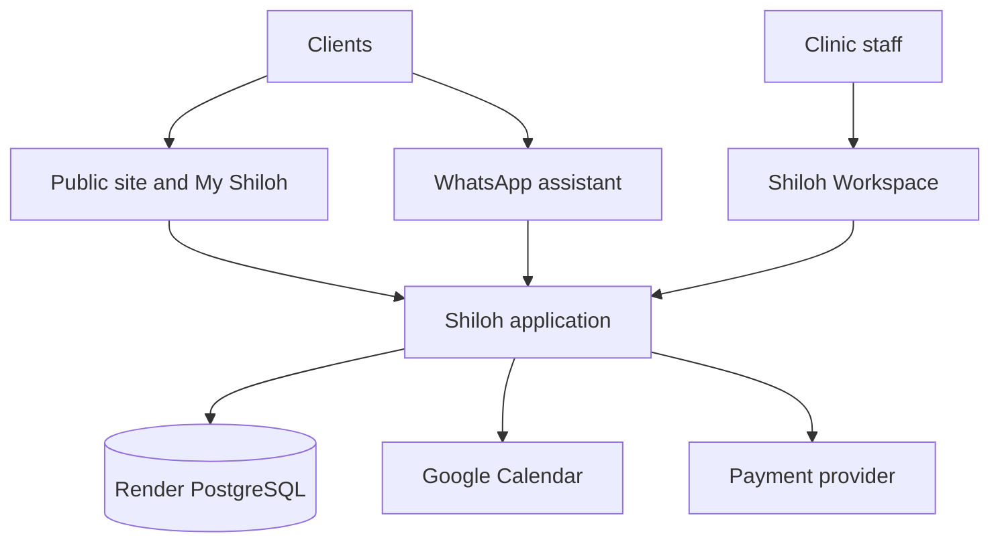

# Shiloh Platform Handbook

**Purpose:** the quickest reliable orientation point for Shiloh's structure, tools, integrations and operating boundaries.

**Status:** canonical orientation map, updated 2026-09-24. This document does not replace application code, migrations, approved policies, Figma files, workflow definitions or production evidence. Those remain the authorities linked below.

## How to use this handbook

- Use it to find the right system, document or tool before making a change.
- Treat statements as **verified**, **documented**, or **to verify**. Do not turn a proposed or historical item into a production fact.
- Never put passwords, API keys, access tokens, raw database URLs or client exports in this document.
- When a new integration or durable decision is accepted, add its owner, authority, safe operational link and verification status here.

## Quick orientation

Shiloh is one clinic platform with several connected surfaces:

| Surface | Responsibility | Primary authority |
| --- | --- | --- |
| Public website and booking | Public information and client booking entry point | Repository application and canonical Services/booking authorities |
| My Shiloh | Client-facing account, booking and care experience | Repository routes, services, migrations and relevant tests |
| Shiloh Workspace | Authenticated staff operations | Repository routes, permissions, Workspace UI and production evidence |
| Shiloh AI Assistant | Customer-facing WhatsApp conversations and workflow entry | Meta/WhatsApp integration, assistant services and business policies |
| Shiloh CRM | Client, booking and operational records | PostgreSQL schema, migrations and repository services |
| Render | Hosting, runtime, deployment and managed PostgreSQL | Render service/deployment state and repository release evidence |

## System map

The application and database are the operational core. Calendar, messaging and payments are integrations around that core; they must not silently become competing authorities for canonical booking, client or policy data.

## Tool and integration inventory

| Tool or integration | Role | Current handling | Authority / safe note |
| --- | --- | --- | --- |
| GitHub | Source, issues, pull requests, Actions and roadmap | Connected GitHub publishing is the default | Current `main`, exact PR head and CI are engineering state |
| Render | Production hosting, services, logs, deploys and PostgreSQL | Connected Render tooling plus dashboard when required | Verify deployed commit, health and migration state after release |
| PostgreSQL | CRM, bookings, approvals, payments, audit and operational state | Versioned migrations; read-only inspection for diagnostics | Schema and migrations are authoritative; do not edit production ad hoc |
| Figma | Brand, design exploration and approved visual reference | Use the connected Figma workflow when a Figma task is requested | Confirm the approved file/page before treating a design as final |
| Storybook | Component and page states | Required review surface for meaningful interface changes | Storybook is UI evidence, not the business-data authority |
| Playwright | Browser journeys, responsive checks and visual evidence | Run affected desktop/phone journeys and accessibility checks | Passing tests do not prove a live payment or external provider delivery |
| Meta WhatsApp Cloud API | Customer messaging and provider delivery state | App integration plus provider callbacks | Delivery evidence must be checked in provider/application records |
| Google Calendar | Synchronized operational calendar view | Calendar is downstream of canonical booking data | It is not the primary booking database |
| Ozow / payment providers | Payment initiation, callbacks and payment evidence | Follow the payment runbook and provider configuration | Never infer payment success from a client-side redirect alone |
| OpenAI Responses API | Assistant capability where configured | Keep prompts, tools and permissions inside repository authorities | Never expose provider credentials or assume model output is policy |
| Public domains/DNS | Website and client entry points | Preserve existing records unless explicitly changing them | Verify live HTTPS, redirects and canonical links after changes |

Items such as the exact approved Figma file, current provider account identifiers, DNS ownership and environment-variable inventory should be verified in their authenticated systems when needed; credentials and sensitive identifiers do not belong here.

## Source-of-truth boundaries

| Question | Start here | Do not infer from |
| --- | --- | --- |
| What should the application do? | `src/`, routes, services and tests | A screenshot or AI response |
| What data exists and how is it constrained? | `src/db/migrations/` and `migrations/` | An exported table or dashboard view |
| Which services, prices and durations are valid? | Canonical Services authority and related migrations | Calendar labels or old handoff notes |
| Is an interface state acceptable? | Storybook plus Playwright/axe/Lighthouse evidence | A single desktop screenshot |
| What is live? | Render deployment, logs, health and exact commit | Local branch state |
| What is the current engineering priority? | GitHub roadmap/issues and current `main` | Dated historical handoff documents |
| What is an approved clinic policy? | Approved repository policy/runbook or owner decision | A guessed default or provider behavior |

## Repository map

| Location | Use |
| --- | --- |
| `src/app.js` and `src/` | Application composition, routes, services and domain behavior |
| `src/db/migrations/` and `migrations/` | Versioned database shape and data rules |
| `public/` | Public site and client-facing assets |
| `.storybook/` and `src/**/*.stories.*` | Component/page states and visual review |
| `tests/` and `scripts/` | Regression, integration, browser and operational checks |
| `docs/` | Runbooks, policy records, architecture notes and handoffs |
| `.github/workflows/` | CI, Storybook, Lighthouse and browser-quality automation |
| `AGENTS.md` | Durable repository working rules and publishing discipline |

Useful canonical documents include [`PRODUCTION-RUNBOOK.md`](PRODUCTION-RUNBOOK.md), [`RUNTIME_ENVIRONMENT_CONTRACT.md`](RUNTIME_ENVIRONMENT_CONTRACT.md), [`PAYMENTS.md`](PAYMENTS.md), [`SHILOH-OS-MASTER-STATUS.md`](SHILOH-OS-MASTER-STATUS.md) and [`SHILOH-OS-CONTROL-COCKPIT.md`](SHILOH-OS-CONTROL-COCKPIT.md). Historical documents remain evidence, not automatic current truth.

## Standard change and release flow

1. Inspect the current repository, production state and relevant canonical documents.
2. Review the idea candidly: problem, fit, benefits, risks, dependencies and next step.
3. Make the smallest coherent change, preserving existing authorities and permissions.
4. Run the applicable focused checks and repository quality gates.
5. Publish through a dedicated branch and pull request using the connected GitHub integration.
6. Test the exact PR head; merge only that tested head.
7. Follow Render's automatic deployment, migration and health state.
8. Verify the requested production behavior and record remaining owner acceptance or follow-up on the existing roadmap.

For interface work, include Storybook review, desktop and phone Playwright coverage, accessibility checks and relevant visual evidence. For payment or messaging work, distinguish application records, provider callbacks and human/client acceptance.

## Runtime, data and security notes

- Render is the production hosting boundary; do not claim a deployment without the exact deployed commit.
- Database changes are migration-led. Startup migration logs and checksum/pending-migration checks are release evidence.
- External Render PostgreSQL connections require TLS. The current ChatGPT database connector limitation is a TLS-boundary issue, not permission to weaken database security.
- The protected audit-read route is an application-mediated, read-only inspection path. It requires its configured audit token and returns sanitized diagnostic data; do not expose that token or raw credentials.
- When direct connector access is blocked, use an authorized Render Shell read-only query or the protected application audit authority, with the result recorded as evidence rather than as a new source of truth.
- Never commit secrets, raw client exports, payment credentials or full connection strings.

### Render database network configuration — verified 2026-09-25

- The Shiloh application service and managed PostgreSQL database run in Render's Oregon region.
- `DATABASE_URL` was compared with the database's **Internal Database URL** in Render and confirmed to match.
- Shiloh therefore uses Render's private internal network for database traffic; an external database IP allowlist is not required for this connection.
- Keep TLS enforced with `sslmode=require`. Never record the URL, password or other secret value here.
- Render support confirmed that this configuration is the recommended same-region setup. This is configuration evidence, not a reason to change production credentials without verification.

### Booking-preparation incident and follow-up — 2026-09-24/25

- The original production booking-preparation failure was PostgreSQL error `42702`: an unqualified `name` column was ambiguous in the availability query. PR #1154 qualified the column and was deployed; this was unrelated to database network routing.
- A later Workspace test selected a time already occupied by an existing appointment. The availability layer correctly treated the slot as unavailable, but the Workspace fallback displayed only a generic preparation error and discarded the detailed conflict explanation.
- The clearer conflict-message improvement is recorded in local commit `daa5237` and still requires its clean GitHub branch, PR, merge and Render verification before it is considered live.

## Operational boundaries

Permission-sensitive work must preserve the existing product model: staff actions are authorized before booking mutations; client, staff and clinic-wide views are not interchangeable; synchronization and reconciliation work must not send unsolicited client messages; and payment success must be based on canonical/provider evidence rather than UI appearance.

Business policies such as deposit percentages, cancellation/no-show windows, practitioner eligibility and staff access must be read from the approved canonical policy/migration/runbook. If the repository and owner decision disagree, stop and resolve the authority conflict before changing behavior.

## Current evidence checkpoint

As of 2026-09-24, the appointment lifecycle diagnostic for appointment 758 has been production-verified through the protected/read-only path and Render Shell evidence: scheduled appointment, approved booking approval, required deposit satisfied, payment ledger recorded and WhatsApp confirmation delivered/read with no provider error. This is a diagnostic evidence checkpoint, not a license to bypass normal permissions or payment controls.

The next roadmap item should be taken from the current GitHub roadmap rather than copied from this paragraph. Update the existing roadmap/issue when the checkpoint is formally closed or owner acceptance changes.

## Troubleshooting index

| Symptom | First place to inspect |
| --- | --- |
| Deployment or startup failure | Render deploy logs, service health, `PRODUCTION-RUNBOOK.md` |
| Migration mismatch or pending migration | Render startup logs, migration files and runtime contract |
| Booking/payment inconsistency | Canonical appointment/payment authorities, migrations, `PAYMENTS.md`, read-only diagnostic evidence |
| WhatsApp delivery uncertainty | Application message records plus Meta/provider delivery callbacks |
| UI regression | Storybook state, affected Playwright journey, axe/Lighthouse output and exact commit |
| Database connector TLS failure | Keep TLS enforced; use authorized application/Render read-only path and escalate connector limitation |
| DNS or HTTPS issue | Domain/DNS records, Render custom-domain state and public smoke checks |

## Updating this handbook

Update this file when the platform map, integration ownership, source-of-truth boundary or safe operating path changes. Keep detailed implementation in the relevant source file, migration, runbook, issue or external system. Add the date and evidence for meaningful checkpoints, and link to the existing canonical record instead of creating a duplicate policy.
