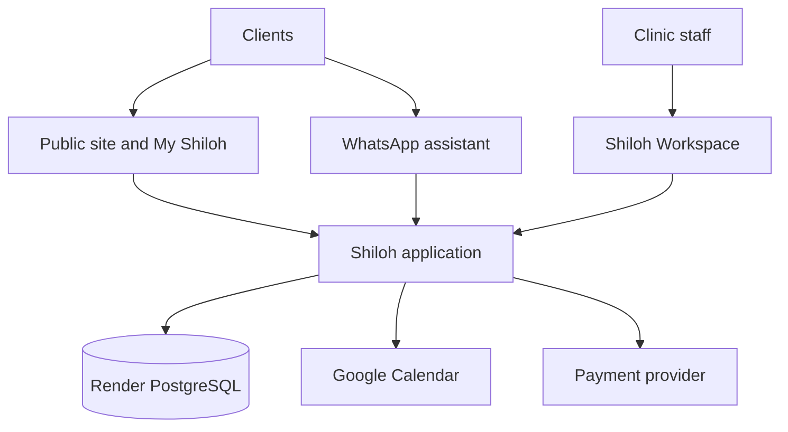

# Shiloh Platform Handbook

**Purpose:** the quickest reliable orientation point for Shiloh's structure, tools, integrations and operating boundaries.

**Status:** canonical orientation map, updated 2026-09-24. This document does not replace application code, migrations, approved policies, Figma files, workflow definitions or production evidence. Those remain the authorities linked below.

## How to use this handbook

- Use it to find the right system, document or tool before making a change.
- Treat statements as **verified**, **documented**, or **to verify**. Do not turn a proposed or historical item into a production fact.
- Never put passwords, API keys, access tokens, raw database URLs or client exports in this document.
- When a new integration or durable decision is accepted, add its owner, authority, safe operational link and verification status here.

## Quick orientation

Shiloh is one clinic platform with several connected surfaces:

| Surface | Responsibility | Primary authority |
| --- | --- | --- |
| Public website and booking | Public information and client booking entry point | Repository application and canonical Services/booking authorities |
| My Shiloh | Client-facing account, booking and care experience | Repository routes, services, migrations and relevant tests |
| Reception iPad check-in | Client-only walk-in intake and appointment-bound forms; supervised device pilot live, client acceptance pending | [Issue #1198](https://github.com/shilohmtc/Shiloh/issues/1198), CRM V2 and consultation-form authorities |

| Shiloh Workspace | Authenticated staff operations | Repository routes, permissions, Workspace UI and production evidence |
| Shiloh AI Assistant | Customer-facing WhatsApp conversations and workflow entry | Meta/WhatsApp integration, assistant services and business policies |
| Shiloh CRM | Client, booking and operational records | PostgreSQL schema, migrations and repository services |
| Render | Hosting, runtime, deployment and managed PostgreSQL | Render service/deployment state and repository release evidence |

The staff app's installed name is **Shiloh Workspace** so it is distinct from the client app **My Shiloh**. Its manifest identity, launch URL and scope stay the same across this display-name change, preserving existing installations and sign-in authority.

**Accepted 2026-09-29; staff installation doorway:** Staff installation links use `https://app.shilohmtc.co.za/calendar/pwa/install`. This public page presents the app installation action and Samsung browser handoff before sign-in. Chrome offers a native install prompt when eligible; otherwise the page gives the browser's installation steps. Staff open the installed app and then sign in through the existing passkey or approved SMS device setup. The manifest identity and staff access checks remain unchanged.

The iPad intake is gated by `SHILOH_CLINIC_IPAD_CHECKIN_ENABLED` and defaults off in new environments. It is on in production for supervised testing as of 27 September 2026. An unactivated iPad receives only a setup message. Real-device privacy checks and separate Christel/Reception account acceptance in issue #1198 must pass before clients use the iPad. This is release status, not a clinic policy.

An activated iPad uses its own revocable, client-only device capability. Its 30-day browser cookie renews on each verified check-in page visit, so regularly used iPads do not require monthly staff sign-in. After 30 days without opening check-in, or if browser data is cleared, a staff member must activate the device again. Workspace can disable a lost iPad immediately; activation revokes the setup staff session.
Client check-in forms include a device-bound form token so Safari can submit when it omits Origin and Fetch Metadata headers. Explicit foreign origins and cross-site Fetch Metadata remain blocked; the device capability remains required on every request.
Production applied `165_clinic_ipad_checkin.sql` in the controlled release of #1199 and cleared `SHILOH_CONTROLLED_RELEASE_MIGRATION` afterward. Keep this setting blank between releases; setting it against an older release or deploying a pending migration without its matching authority can fail startup.

## System map

```mermaid
flowchart TD
    Clients[Clients] --> Public[Public site and My Shiloh]
    Clients --> WhatsApp[WhatsApp assistant]
    Staff[Clinic staff] --> Workspace[Shiloh Workspace]
    Public --> App[Shiloh application]
    WhatsApp --> App
    Workspace --> App
    App --> DB[(Render PostgreSQL)]
    App --> Calendar[Google Calendar]
    App --> Payments[Payment provider]
```

The application and database are the operational core. Calendar, messaging and payments are integrations around that core; they must not silently become competing authorities for canonical booking, client or policy data.

My Shiloh Home shows a short deposit prompt with the amount and payment action; the booking and payment pages carry the full policy. Clients can archive and restore Updates on their current phone. This stores only bounded notification IDs for that signed-in client in the installed app; it does not delete server notifications, change booking or payment state, or sync the archive to another phone.

For iPhone installation, the public website sends clients to `https://app.shilohmtc.co.za/my-shiloh/`. Safari and Chrome can add the correct My Shiloh address to the Home Screen. In newer Safari layouts, Share is inside the page menu at the bottom; other tab layouts expose Share directly. The guide should name both paths before Add to Home Screen, Open as Web App, and Add. Clients arriving in the Google app should use Open in browser and check that the address is `app.shilohmtc.co.za` in Safari or Chrome before adding it. A Google `share.google` share sheet is not the My Shiloh app origin and must not be installed. The app's install doorway guides that handoff; iOS does not allow a website to add a Home Screen app without the client's browser action.

**Accepted 2026-09-28; client installation doorway:** Website install links lead to the same My Shiloh origin. In a regular browser this route shows one focused installation action and device-specific browser guidance, without SMS, passkey or recovery forms. The client opens the Home Screen app to sign in with a saved passkey or an SMS code, then saves a passkey if new. Android may offer a native install prompt; iPhone requires the browser Share → Add to Home Screen action. An already installed client opens the icon; website treatment handoff continues to show its code when present.

## Tool and integration inventory

| Tool or integration | Role | Current handling | Authority / safe note |
| --- | --- | --- | --- |
| GitHub | Source, issues, pull requests, Actions and roadmap | Connected GitHub publishing is the default | Current `main`, exact PR head and CI are engineering state |
| Render | Production hosting, services, logs, deploys and PostgreSQL | Connected Render tooling plus dashboard when required | Verify deployed commit, health and migration state after release |
| PostgreSQL | CRM, bookings, approvals, payments, audit and operational state | Versioned migrations; read-only inspection for diagnostics | Schema and migrations are authoritative; do not edit production ad hoc |
| Figma | Brand, design exploration and approved visual reference | Use the connected Figma workflow when a Figma task is requested | Confirm the approved file/page before treating a design as final |
| Storybook | Component and page states | Required review surface for meaningful interface changes | Storybook is UI evidence, not the business-data authority |
| Playwright | Browser journeys, responsive checks and visual evidence | Run affected desktop/phone journeys and accessibility checks | Passing tests do not prove a live payment or external provider delivery |
| Meta WhatsApp Cloud API | Customer messaging and provider delivery state | App integration plus provider callbacks | Delivery evidence must be checked in provider/application records |
| Google Calendar | Synchronized operational calendar view | Calendar is downstream of canonical booking data | It is not the primary booking database |
| Ozow / payment providers | Payment initiation, callbacks and payment evidence | Follow the payment runbook and provider configuration | Never infer payment success from a client-side redirect alone |
| OpenAI Responses API | Assistant capability where configured | Keep prompts, tools and permissions inside repository authorities | Never expose provider credentials or assume model output is policy |
| Public domains/DNS | Website and client entry points | Preserve existing records unless explicitly changing them | Verify live HTTPS, redirects and canonical links after changes |

Items such as the exact approved Figma file, current provider account identifiers, DNS ownership and environment-variable inventory should be verified in their authenticated systems when needed; credentials and sensitive identifiers do not belong here.

## Source-of-truth boundaries

| Question | Start here | Do not infer from |
| --- | --- | --- |
| What should the application do? | `src/`, routes, services and tests | A screenshot or AI response |
| What data exists and how is it constrained? | `src/db/migrations/` and `migrations/` | An exported table or dashboard view |
| Which services, prices and durations are valid? | Canonical Services authority and related migrations | Calendar labels or old handoff notes |
| Is an interface state acceptable? | Storybook plus Playwright/axe/Lighthouse evidence | A single desktop screenshot |
| What is live? | Render deployment, logs, health and exact commit | Local branch state |
| What is the current engineering priority? | GitHub roadmap/issues and current `main` | Dated historical handoff documents |
| What is an approved clinic policy? | Approved repository policy/runbook or owner decision | A guessed default or provider behavior |

## Repository map

| Location | Use |
| --- | --- |
| `src/app.js` and `src/` | Application composition, routes, services and domain behavior |
| `src/db/migrations/` and `migrations/` | Versioned database shape and data rules |
| `public/` | Public site and client-facing assets |
| `.storybook/` and `src/**/*.stories.*` | Component/page states and visual review |
| `tests/` and `scripts/` | Regression, integration, browser and operational checks |
| `docs/` | Runbooks, policy records, architecture notes and handoffs |
| `.github/workflows/` | CI, Storybook, Lighthouse and browser-quality automation |
| `AGENTS.md` | Durable repository working rules and publishing discipline |

Useful canonical documents include [`PRODUCTION-RUNBOOK.md`](PRODUCTION-RUNBOOK.md), [`RUNTIME_ENVIRONMENT_CONTRACT.md`](RUNTIME_ENVIRONMENT_CONTRACT.md), [`PAYMENTS.md`](PAYMENTS.md), [`SHILOH-OS-MASTER-STATUS.md`](SHILOH-OS-MASTER-STATUS.md) and [`SHILOH-OS-CONTROL-COCKPIT.md`](SHILOH-OS-CONTROL-COCKPIT.md). Historical documents remain evidence, not automatic current truth.

## Standard change and release flow

1. Inspect the current repository, production state and relevant canonical documents.
2. Review the idea candidly: problem, fit, benefits, risks, dependencies and next step.
3. Make the smallest coherent change, preserving existing authorities and permissions.
4. Run the applicable focused checks and repository quality gates.
5. Publish through a dedicated branch and pull request using the connected GitHub integration.
6. Test the exact PR head; merge only that tested head.
7. Follow Render's automatic deployment, migration and health state.
8. Verify the requested production behavior and record remaining owner acceptance or follow-up on the existing roadmap.

For interface work, include Storybook review, desktop and phone Playwright coverage, accessibility checks and relevant visual evidence. For payment or messaging work, distinguish application records, provider callbacks and human/client acceptance.

### Accepted interface boundaries — 2026-09-27

- Signed-out My Shiloh visitors can explore services, but booking actions lead to the passkey or SMS sign-in on Home. The private booking page and booking APIs remain session-bound; a direct guest visit to the booking page returns to the sign-in entry. Public website booking remains a separate public entry point.
- My Shiloh sign-in uses a saved passkey, SMS setup/recovery, or a saved recovery code. WhatsApp links are for human Reception contact and ordinary clinic messaging, not account verification.
- **Superseded by the 2026-09-29 client sign-in decision:** The earlier goal was passkeys with no SMS or WhatsApp recovery dependency; SMS is now accepted for first enrollment and recovery. A client with an active passkey can create one high-entropy, one-use recovery code; only its hash is stored, and a replacement invalidates the previous code. On recovery, the client signs into the existing CRM account and should save a new passkey and code. Synced passkeys or another registered device can also sign in. Clients who lose every passkey and their code must contact Reception for supervised identity review; no automatic identity reset is authorized by this decision. WhatsApp sign-in was retained until the SMS path showed successful production completions; retirement is authorized on 2026-09-29. Keep human Reception available when a client loses phone and recovery access. Implementation authority: `src/services/clientPasskeyRecovery.js`, My Shiloh routes/UI, and migration 175. Production status belongs to the exact merged and deployed commit, not this note.
- **Accepted 2026-09-28; SMS enrollment live:** A valid server-side My Shiloh client session opens the installed app without an extra installation-specific check. Clients with a saved passkey can sign in directly at the canonical secure My Shiloh page or in the installed app. This first-launch change shipped in PR #1259, merge `b289910c15bc3b3d7002c73181fbd93e6e9febd7`, and Render deployed it live on 2026-09-28. Meta refused to create the dedicated Authentication code template through both the API and WhatsApp Manager. The accepted enrollment channel is now a short-lived SMS code delivered by Shiloh's SMSMessenger account to the number entered in My Shiloh. Verify the code before binding to the exact CRM mobile owner, and never expose a different client's private record to an unrecognised number. Existing passkeys remain the preferred sign-in method; SMS supports first enrollment and recovery. Render request logs on 2026-09-28 show multiple SMS starts returning 201 followed by verifications returning 200; the owner authorized retirement of client WhatsApp sign-in on 2026-09-29. The client cutover removes its webhook interception, start/complete/status endpoints and dormant browser handoff code; existing authenticated sessions remain valid. Clinic WhatsApp conversations and reminders are separate from sign-in. The client Meta OTP template contract is retained only as a retired, non-sendable historical identity; the standalone provisioner and script are removed. This housekeeping shipped in PR #1297, merge `3698776eec2bc65c2ea715adb4274a51a51ba912`; all exact-head workflows passed and Render deploy `dep-datm8lm0tbcc7383n3fg` became live on 2026-09-29. Health, My Shiloh and Workspace entry pages returned 200; the My Shiloh guest page still offered SMS, passkey and human Reception WhatsApp. The shared staff passkey registration service remains in use by authorized SMS device setup. This housekeeping slice moves it to `staffPasskeyDeviceBootstrap.js` and removes retired phone lookup and WhatsApp issuance methods, while retaining existing setup URLs and historical database source rejection. PR #1299 merged as `a5f783d91fba989aaf0a50f15b0294db98080934`; all exact-head workflows passed and Render deploy `dep-datmm6mq1p3s73fj1j20` became live on 2026-09-29. Production health, staff sign-in, SMS setup, passkey setup and My Shiloh returned 200. These public checks do not establish a new staff enrollment after deployment; the dedicated staff passkey browser proof passed in CI. PR #1295 merged as `032a2a2fbf4d9b8567ecc5ca6380a2458d16598d`; all exact-head workflows passed, and Render deploy `dep-datliqff3r2c73eqmk2g` became live on 2026-09-29. Production health and the My Shiloh page returned 200; the three retired POST routes (`/my-shiloh/auth/start`, `/complete`, `/status`) returned 404, and the guest help link pointed to human Reception at 066 239 9138. These checks do not establish a new authenticated client sign-in attempt after the cutover. Secrets stay only in Render environment settings; the new SMS sign-in is gated by `MY_SHILOH_SMS_AUTH_ENABLED=true` after tested deployment.
- **Accepted 2026-09-28; first sign-in setup:** Once a client is signed in to the installed My Shiloh app, check their existing passkeys against the server. If none are saved, put a prominent passkey setup action before the Home content and keep it visible until the credential is actually registered. After a saved passkey is confirmed, offer device notifications as the next optional action. Request notification permission only from the client's own tap, respect a declined or deferred request, and keep Profile settings available. Failed or unsupported passkey setup must not lock a verified client out of bookings or recovery. This is a client setup prompt, not authorization to remove the SMS recovery route or change the server's CRM identity boundary.
- **Notification value and consent:** Explain the benefit of appointment reminders and existing booking, form, payment, voucher and Rewards updates in the optional setup card. A phone's notification permission does not grant promotional consent; specials require a separate client choice, marketing delivery authority and an easy opt-out before they can be promised here. Do not block access to My Shiloh when a client declines notifications.
- **Accepted 2026-09-28; SMS credit protection:** Keep SMS available for client first enrollment and recovery, with passkeys as the daily sign-in. In addition to the existing one-minute resend delay, hourly caps and single-use ten-minute codes, restrict SMS challenges to six per normalized mobile and fifty clinic-wide over any rolling 24 hours. Serialize daily budget checks in the database so parallel callers cannot exceed the cap. Count reserved challenges conservatively, including provider failures, and emit a sanitized warning as the clinic approaches the cap. This protects SMS credits but may temporarily delay a legitimate recovery during an attack; Reception can assist without bypassing identity proof. SMS alone must not weaken the CRM ownership boundary.
- **Accepted 2026-09-28; passkey-first client entry:** Present the passkey as the ordinary My Shiloh sign-in. Put SMS verification behind the "New to My Shiloh or using a new phone?" disclosure on signed-out Home, Profile and Wallet; describe it as setup and recovery, not an equal everyday sign-in. Keep the saved recovery code under "Can’t use your passkey?". After SMS verification, the existing server-checked passkey setup prompt remains prominent until a credential is saved, with notification setup offered next. Keep genuine SMS recovery accessible and the existing rate limits in force; a failed or unsupported passkey setup must not strand a verified client. This presentation does not impose a one-SMS-per-account rule.
- **Accepted 2026-09-28; human recovery contact:** A signed-out client who has lost both phone access and the recovery code may contact Reception by phone or WhatsApp from another available device. Display both direct contact actions under the compact recovery disclosure on Home, Profile and Wallet. Use the configured human Reception WhatsApp number when valid, otherwise the published Reception number; never route this contact through Shiloh AI or treat a WhatsApp message as identity proof. Reception checks identity before helping with any account recovery. No automatic reset is authorized.
- **Accepted 2026-09-28; staff SMS recovery verified 2026-09-29:** Workspace staff use passkeys for ordinary sign-in. A person with a recent passkey session may add another device from Devices & sign-in. For first enrollment or lost-device recovery, a different authorized administrator with a recent passkey session and `staff_auth:reset` confirms the person's identity and recorded number, then requests an SMS setup code. The recipient opens the separate setup link on the new device, enters the SMS code within ten minutes, and creates a passkey. Replacement revokes previous passkeys and sessions only after successful registration. SMS by itself does not authorize privileged device binding; no new account, role or scope is created. Jean-Pierre completed SMS verification and passkey enrollment on his Samsung on 2026-09-29; the owner accepted this production journey. The old WhatsApp staff bootstrap and unsupervised Reception setup link were retired in PR #1292, merge `84778815112535d9fcc2845c7c7580882e087bcb`. Implementation: `src/services/staffSmsDeviceSetup.js`, migration 178, and the existing staff passkey bootstrap. PRs #1288 and #1291 deployed the SMS recovery path. All exact-head PR #1292 workflows passed; Render deploy `dep-datkmtnf3r2c73epqpo0` became live on 2026-09-29 with migration ledger 178/178 and health 200. Public staff sign-in, installation, SMS setup, and My Shiloh pages returned 200. Authenticated staff recovery remains protected by the existing recent-passkey, reset-authority, and SMS verification checks.
- **Administrator recovery reachability:** The owner-facing Staff access screen must include administrator and shared Workspace accounts even when they have no linked staff profile, with a route to their Devices & sign-in approval. Staff SMS recovery may remain operational when the WhatsApp bootstrap flag is off, provided client SMS delivery and staff passkey authority are enabled. Old WhatsApp staff issuance is permanently disabled by this release, including when its former environment flag remains true. A different authorized administrator with recent passkey authentication is still required; deleting the last authorized passkey cannot be recovered by self-approved SMS.
- My Shiloh uses its bottom navigation for Home and the Shiloh assistant. The duplicate top-left logo/name header is removed; the middle tab stays labelled “Shiloh” because it opens the assistant. Its official circular mark matches the “Need help choosing?” card in size and finish. Installation retains its separate doorway.
- The once-off welcome voucher is presented inside My Shiloh only after client verification and an eligibility check. A signed-out visit must not imply that the visitor can claim the offer; redeemed clients should not see the offer again. The public website can still describe the promotion before identity is known.
- Signed-in greetings and profile names wrap legibly on narrow phones, including longer names. My Shiloh offers an appointment notification setup link on Home when this installed app has no push subscription; the client chooses whether to grant device permission under Profile. Booking information remains available inside the signed-in app and existing WhatsApp reminder authority continues independently.
- Each server start writes a sanitized `My Shiloh cutover cohort coverage` log with counts of active CRM V2 clients, enabled and recently accepted push routes, distinct clients booked in the next 30 days, legacy booked clients and legacy birthday opt-ins. These counts are evidence for targeted notification cutover; an enabled push route is not proof of app installation, device receipt or client reading. No client details enter the log. Keep clinic message fallbacks for uncovered clients and preserve independent human Reception conversations. Client authentication uses passkeys, SMS verification and recovery codes.
- My Shiloh Home leads with the canonical next booking or request status and its action; the welcome drink detail follows those decisions. Guests see the booking steps and the explicit Reception confirmation boundary. The latest-updates section appears only for actual notifications or a retrieval problem, keeping an empty Home focused.
- Signed-in clients asking for help choosing on Home enter the existing in-app Shiloh conversation. An active Reception handoff opens that same view so the client sees its status and the Reception path. Guests do not see the Home choosing card, which otherwise sent them to a WhatsApp assistant. The guest booking steps remain visible without a duplicate jump button. Assisted recovery for someone who loses both phone access and a saved code is a direct Reception call with identity review, not an automatic account reset; this contact path remains available from guest sign-in screens.
- Signed-in clients asking for appointment-change help from Bookings enter that same in-app conversation. During an active Reception handoff, Bookings directs them to human Reception; guests see an explicitly labelled human Reception WhatsApp help action, using the configured human number or published Reception number. The old client sign-in handoff and My Shiloh links to the WhatsApp AI assistant are retired. Existing appointment notices and clinic messaging remain separate. Historical WhatsApp AI exchanges can still be imported by a verified client within six hours if present; that bridge does not grant sign-in authority or transfer app private facts to WhatsApp.
- **Accepted 2026-09-29 channel target:** Only human Reception WhatsApp at **066 239 9138** should remain available. Christel tested Shiloh's in-app communication and accepted retirement of automated WhatsApp bot conversations, staff alerts, approval messages, payment messages and client notices. The mounted `src/routes/webhook.js` already acknowledges ordinary incoming messages without loading the old conversation controller; it still handles provider status receipts. Outbound automated send code remains behind `SHILOH_META_SIGNIN_ONLY_ENABLED` and other channel flags, so this target is not a claim that all send code or Meta configuration has been removed. The earlier WhatsApp reminder/fallback guidance above applies only until each delivery obligation is migrated or explicitly retired. Booking confirmations, reminders and changes queue My Shiloh notifications, but their code can still choose a WhatsApp template when no push wake is accepted if the outbound guard is off; practitioner approval, payment and other template senders have separate paths. Map each sender to its Workspace/My Shiloh outcome or a visible Reception exception queue, prove it in production, then remove automated send code and unneeded Meta secrets. Keep the human Reception number/link and the Render outbound guard while the cutover remains incomplete. Render's sanitized 2026-09-29 cohort log counted 5 of 108 active My Shiloh clients with enabled push and 2 of 20 upcoming-booking clients with push; app access alone does not establish phone-alert delivery.
- Appointment notification invitations open the Profile notification control directly. The detailed problem-report form stays under an explicit Help disclosure so normal Profile tasks remain easy to find.
- Workspace confirmations use the shared `workspaceConfirmation` presentation component. Name the affected item, state the consequence, and label both the safe and committing actions. Start with Services category deletion, service deactivation and practitioner removal. Keep the existing server-side Services authority and validation as the final decision.

These are accepted implementation standards; release and production verification are tracked by the corresponding pull request and deployment evidence.

## Runtime, data and security notes

- Render is the production hosting boundary; do not claim a deployment without the exact deployed commit.
- Database changes are migration-led. Startup migration logs and checksum/pending-migration checks are release evidence.
- Startup patch housekeeping begins with the no-op `adminBlockTimePatch.js`: Block Time already belongs to Calendar, so the unused preload is removed from production and development startup. Keep the Calendar block authority and ordinary WhatsApp boundary unchanged; remove other preloads only after tracing their live behavior and tests individually. [PR #1301](https://github.com/shilohmtc/Shiloh/pull/1301) passed its exact-head workflows and merged as `ae14ab2a6216c4fc5375ae65ac1ab569826165c4`. Render deployment `dep-datn7mvf3r2c73du5t2g` reached live for that commit on 2026-09-29; `/health` reported application and database `ok`, and `/calendar/staff` and `/my-shiloh/` returned HTTP 200. Authenticated Block Time behavior remains outside this public-route verification.
- The staff booking start-time list is formatted by `adminMobileBookingFlow.slotsInteractive` itself. The `adminManualStartTimePickerPatch.js` module-loader hook and its production/development preloads are removed; authoritative 15-minute slot generation, typed-time handling, booking guards and the human Reception WhatsApp path remain intact. [PR #1303](https://github.com/shilohmtc/Shiloh/pull/1303) passed its exact-head workflows and merged as `d7f38480b4b64cdb19907713ae414db03fbcb22d`. Render deployment `dep-datnndeq1p3s73fk5rv0` reached live on 2026-09-29; `/health` reported application and database `ok`, while `/calendar/staff` and `/my-shiloh/` returned HTTP 200. Authenticated staff booking remains outside this public-route verification.
- The preceding `adminMobileBookingFlow` change concerns a retired WhatsApp Admin booking path, not Workspace booking. The webhook already routes staff booking commands to Workspace retirement authority; no owner manual booking test is required for that legacy presentation. [PR #1305](https://github.com/shilohmtc/Shiloh/pull/1305) removed the orphaned flow, session, entitlement, UX standardization and three startup hooks while preserving database history and shared booking services. All exact-head workflows passed; merge `8d295533739a8a5e174ab78feffe7d62d9c387b6` deployed live as `dep-dato7hdg1s2s73f9h140` on 2026-09-29. `/health` reported application and database `ok`; `/calendar/staff` and `/my-shiloh/` returned HTTP 200. This verifies the retired staff code cleanup, not the broader automated WhatsApp channel cutover.
- External Render PostgreSQL connections require TLS. The current ChatGPT database connector limitation is a TLS-boundary issue, not permission to weaken database security.
- The protected audit-read route is an application-mediated, read-only inspection path. It requires its configured audit token and returns sanitized diagnostic data; do not expose that token or raw credentials.
- When direct connector access is blocked, use an authorized Render Shell read-only query or the protected application audit authority, with the result recorded as evidence rather than as a new source of truth.
- Never commit secrets, raw client exports, payment credentials or full connection strings.

### Render database network configuration — verified 2026-09-25

- The Shiloh application service and managed PostgreSQL database run in Render's Oregon region.
- `DATABASE_URL` was compared with the database's **Internal Database URL** in Render and confirmed to match.
- Shiloh therefore uses Render's private internal network for database traffic; an external database IP allowlist is not required for this connection.
- Keep TLS enforced with `sslmode=require`. Never record the URL, password or other secret value here.
- Render support confirmed that this configuration is the recommended same-region setup. This is configuration evidence, not a reason to change production credentials without verification.

### Booking-preparation incident and follow-up — 2026-09-24/25

- The original production booking-preparation failure was PostgreSQL error `42702`: an unqualified `name` column was ambiguous in the availability query. PR #1154 qualified the column and was deployed; this was unrelated to database network routing.
- A later Workspace test selected a time already occupied by an existing appointment. The availability layer correctly treated the slot as unavailable, but the Workspace fallback displayed only a generic preparation error and discarded the detailed conflict explanation.
- The clearer conflict-message improvement is recorded in local commit `daa5237` and still requires its clean GitHub branch, PR, merge and Render verification before it is considered live.

## Operational boundaries

Permission-sensitive work must preserve the existing product model: staff actions are authorized before booking mutations; client, staff and clinic-wide views are not interchangeable; synchronization and reconciliation work must not send unsolicited client messages; and payment success must be based on canonical/provider evidence rather than UI appearance.

Business policies such as deposit percentages, cancellation/no-show windows, practitioner eligibility and staff access must be read from the approved canonical policy/migration/runbook. If the repository and owner decision disagree, stop and resolve the authority conflict before changing behavior.

## Current evidence checkpoint

As of 2026-09-24, the appointment lifecycle diagnostic for appointment 758 has been production-verified through the protected/read-only path and Render Shell evidence: scheduled appointment, approved booking approval, required deposit satisfied, payment ledger recorded and WhatsApp confirmation delivered/read with no provider error. This is a diagnostic evidence checkpoint, not a license to bypass normal permissions or payment controls.

The next roadmap item should be taken from the current GitHub roadmap rather than copied from this paragraph. Update the existing roadmap/issue when the checkpoint is formally closed or owner acceptance changes.

## Troubleshooting index

| Symptom | First place to inspect |
| --- | --- |
| Deployment or startup failure | Render deploy logs, service health, `PRODUCTION-RUNBOOK.md` |
| Migration mismatch or pending migration | Render startup logs, migration files and runtime contract |
| Booking/payment inconsistency | Canonical appointment/payment authorities, migrations, `PAYMENTS.md`, read-only diagnostic evidence |
| WhatsApp delivery uncertainty | Application message records plus Meta/provider delivery callbacks |
| UI regression | Storybook state, affected Playwright journey, axe/Lighthouse output and exact commit |
| Database connector TLS failure | Keep TLS enforced; use authorized application/Render read-only path and escalate connector limitation |
| DNS or HTTPS issue | Domain/DNS records, Render custom-domain state and public smoke checks |

## Updating this handbook

Update this file when the platform map, integration ownership, source-of-truth boundary or safe operating path changes. Keep detailed implementation in the relevant source file, migration, runbook, issue or external system. Add the date and evidence for meaningful checkpoints, and link to the existing canonical record instead of creating a duplicate policy.
